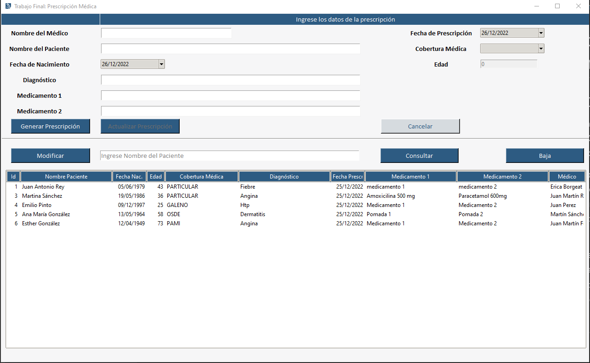

# Proyecto Trabajo Final Nivel Intermedio de Python - UTN: Receta Médica

## DESCRIPCIÓN GENERAL 
Es un programa que permite a un usuario médico generar la RECETA O PRESCRIPCIÓN MÉDICA ELECTRÓNICA que se requiere para el paciente, luego de la consulta médica. 

La aplicación permite ingresar los datos de médico y paciente, así como el diagnóstico y medicamentos indicados y dar de ALTA la receta. También gestionar recetas anteriormente generadas, mediante procesos de CONSULTA, MODIFICACIÓN de datos, o ELIMINACIÓN de recetas cuando se requiera.

Los campos de información deben ser ingresados por el usuario médico (mediante tipeo, selección en opciones dadas, o calendario de fechas), excepto por la edad del paciente que es un campo calculado o el campo de fecha de prescripción que toma la fecha del día de hoy.



## INICIO:
Al ejecutar el archivo main.py, la aplicación abre una ventana, que muestra dos partes. La parte superior, tiene el formulario de ingreso, con los campos de información requeridas al usuario médico. La inferior, muestra las prescripciones generadas previamente y las opciones de gestión para las mismas. Al ejecutarlo por primera vez, genera la base de datos que utilizará para guardar los datos que componen las recetas médicas (receta_medica.db). 
## ALTA: 
Para dar el alta de la receta, se requiere el ingreso de información de texto en todos los campos del formulario.
La fecha de la prescripción toma la fecha del día de hoy del equipo/servidor del usuario. El campo fecha de nacimiento del paciente, se selecciona en el calendario disponible. La edad del paciente, se calcula, tomando como base las dos fechas antes mencionadas. 
Una vez ingresados los datos en todos los campos requeridos, se puede usar el botón GENERAR PRESCRIPCIÓN. El mismo genera el registro en la base de datos, asignando un ID numérico autogenerado, que numera correlativamente las prescripciones que el usuario va creando.
Luego de agregar una nueva receta, el formulario se blanquea para iniciar nuevamente el proceso.
## CONSULTA: 
El usuario médico puede consultar la base de datos, utilizando el campo vacío de la parte inferior del formulario dónde visualiza el texto “Ingrese Nombre del Paciente…”. El ingreso del nombre del paciente, le permite buscar en la base de registros y acceder a las recetas previamente generadas para ese paciente, con el botón CONSULTA. 
## MODIFICACIÓN: 
Luego de realizar la consulta, el usuario médico puede ver los resultados de su búsqueda, y seleccionar la receta que desea modificar, y clickeando en el botón MODIFICAR. Esta acción, muestra los datos de la receta que fueron guardados previamente en la parte superior del formulario, para ser editados según se requiera. Una vez realizados los cambios necesarios, se debe usar el botón ACTUALIZAR PRESCRIPCIÓN, para guardar los nuevos datos y proceder a la actualización del registro (bajo el mismo ID). 
Luego de realizada la modificación, el formulario se blanquea para iniciar un nuevo proceso.
## CANCELAR:
Durante el proceso de carga o modificación de datos, si el usuario desea cancelar el proceso, puede hacerlo mediante el botón CANCELAR. Si se trata de un alta de receta, los datos ingresados en el formulario se borran, dejando el mismo en blanco para reiniciar el proceso. En el caso de una modificación, los datos de la receta que se iba a modificar, se mantienen sin cambios.
En ambos casos, el botón cancelar, genera que el formulario se blanquee para iniciar un nuevo proceso.
## ELIMINACIÓN: 
El usuario médico puede eliminar un registro, seleccionándolo de la lista de recetas ya generadas visibles en la parte inferior del formulario, o realizando una consulta por nombre del paciente a la base de datos. Una vez seleccionada la receta que desea eliminar, puede proceder a la baja con el botón BAJA. En este caso, como en otros, recibe una notificación que solicita confirmar la acción. Una vez confirmada, el registro se elimina y se actualiza el treeview donde ya no se muestra la misma.
## VALIDACIÓN DE DATOS: 
La aplicación valida al momento de ingreso o modificación de datos que se ingrese texto en los campos “Nombre del médico” y “Nombre del Paciente”. 
## NOTIFICACIONES: 
A medida que el usuario utiliza la aplicación realizando distintas acciones (alta, baja, modificación, cancelación, eliminación de registro, etc), recibe notificaciones, por medio de las cuales se solicita confirmación de la acción que está por realizarse. 

## FUNCIONAMIENTO
### Versión de Python
3.9

### ORM
Peewee

### Base de datos
SQLite

### Instalación de TKCalender
```bash
pip install tkcalendar
```
### GUI
Tkinter

### Documentación
Sphinx
 
## Modelo de Datos
### Nombre del campo - Tipo de dato
- rec_med_id	Integer - Autoincremental
- medico	Text
- f_prescripcion	Text
- paciente	Text
- fec_nac_pac	Text
- edad	Integer
- cobertura	Text
- diagnostico	Text
- medicamento_1	Text
- medicamento_2	Text


